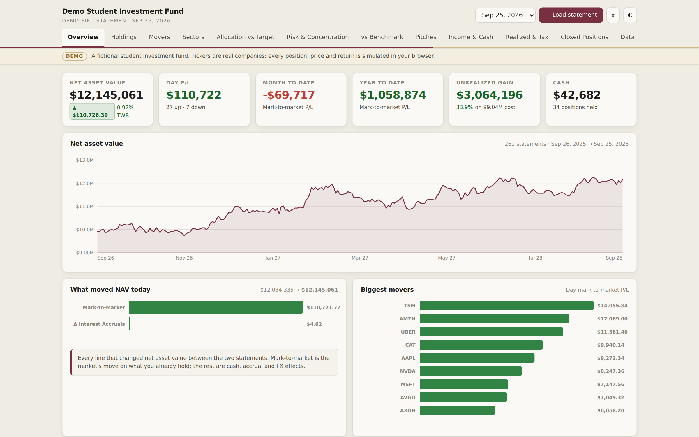
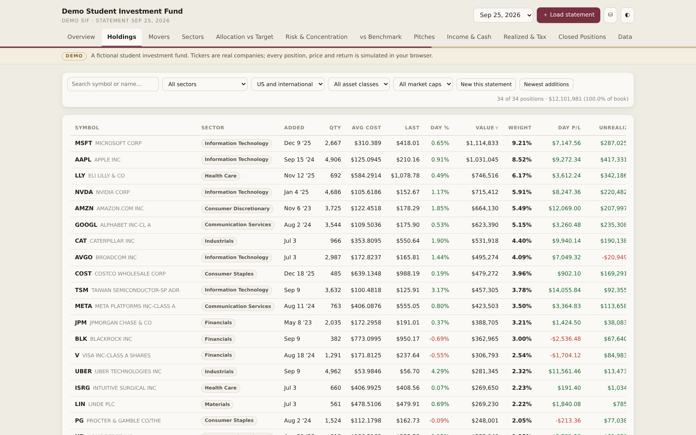
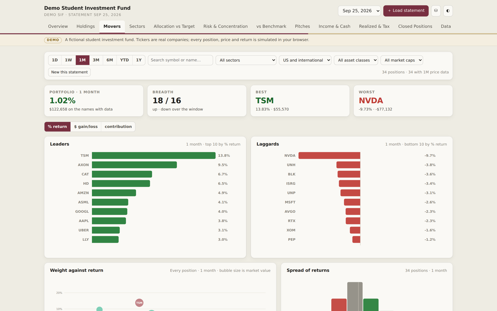
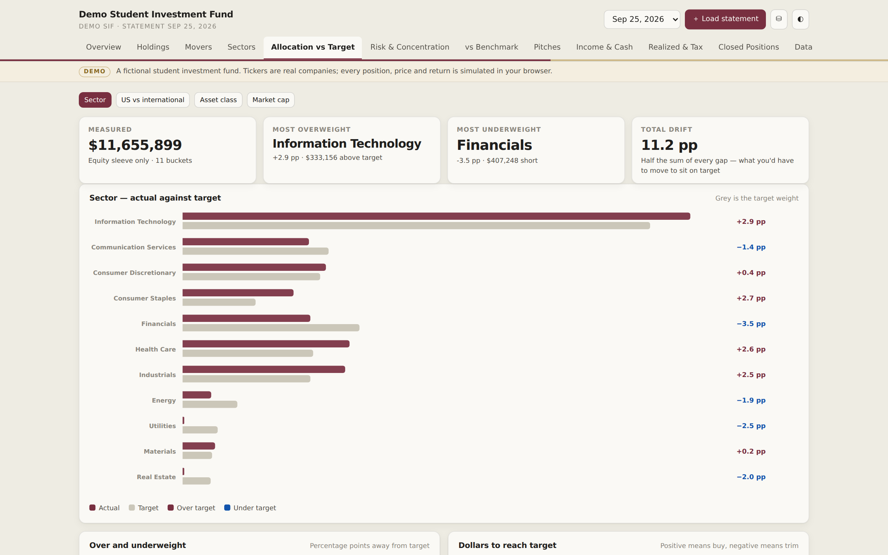
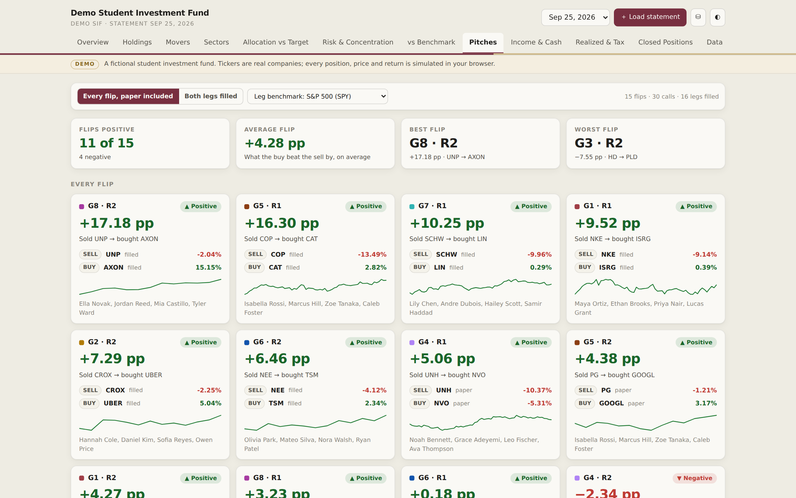
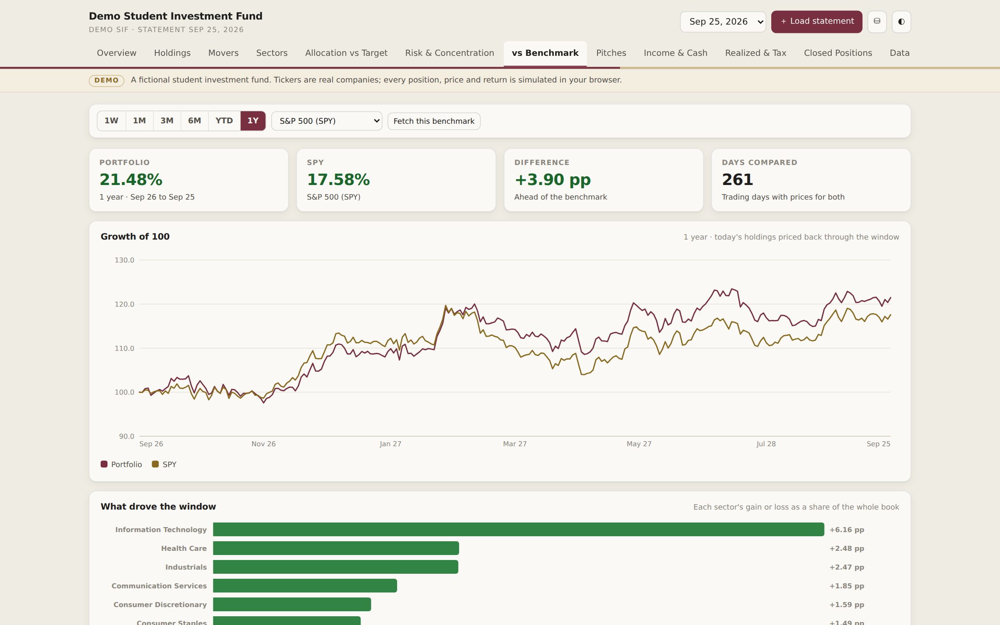
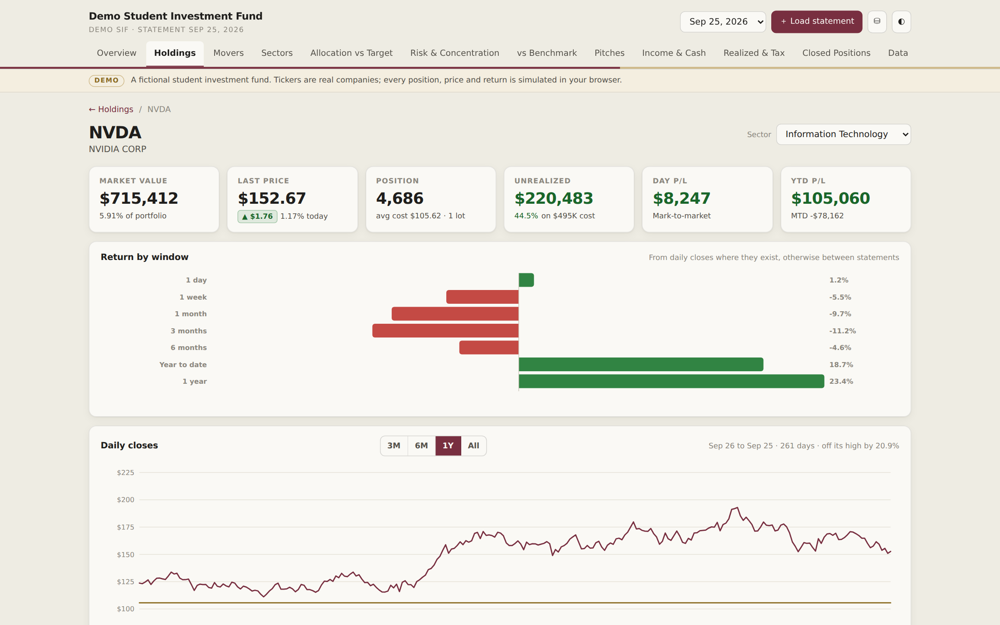
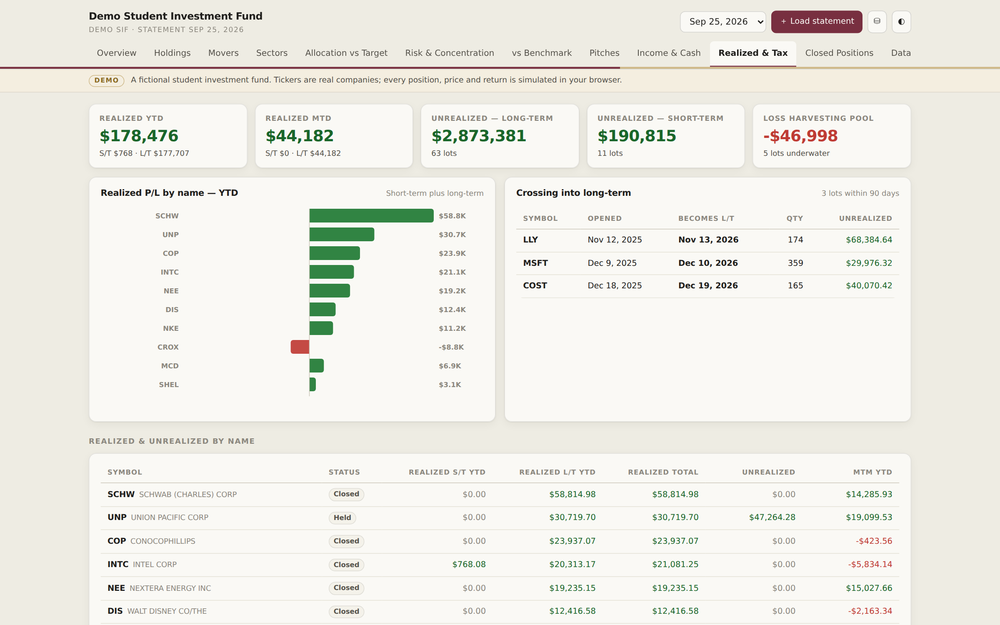
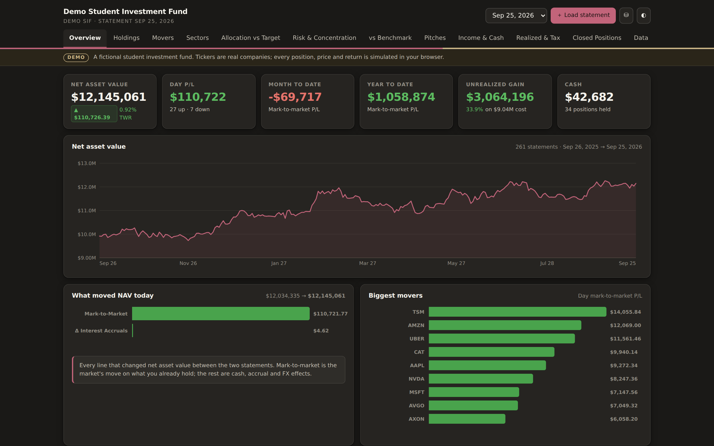

# Student Investment Fund Dashboard

A single-file portfolio dashboard for a student-managed investment fund, built on the daily activity statements Interactive Brokers sends.

**Live demo:** https://liamshields4.github.io/sif-dashboard/

> **Demo data.** The fund in the demo is fictional. Tickers are real companies, but every position, price, trade and return is simulated in your browser when the page opens. The snapshot is dated September 25, 2026.

## What it does

- **Reads IBKR statements in the browser.** Drop in a daily Activity Statement as HTML or PDF. The file is parsed locally with pdf.js and never uploaded.
- **Holdings and tax lots.** Every position with cost, weight, day P/L, unrealized gain and the date it was added, plus a page per holding with its lots and price history.
- **Movers.** Leaders and laggards by percent return, dollar P/L or contribution over 1 day, 1 week, 1 month, 3 months, 6 months, year to date and 1 year.
- **Allocation vs target.** Sector, US vs international, asset class and market cap against editable targets, starting from S&P 500 sector weights.
- **Risk and concentration.** Top-10 weight, effective number of positions, position-size distribution and a concentration curve.
- **Benchmark comparison.** Growth of 100 against SPY, ACWI, AGG or equal-weight S&P, with the sectors that drove the gap.
- **Pitch tracker.** Each student group pitches one buy and one sell. The dashboard pairs them into a "flip" and scores it as the buy's return minus the sell's return. Executed pitches use the actual fills from the statement, and paper pitches enter at the market open on the day they were pitched.
- **Income, realized gains and exits.** Dividend ledger, cash report, short- vs long-term realized P/L, lots about to turn long-term, and every position closed this year.
- **Light and dark themes**, and a JSON backup of the full history.

## How it's built

- One HTML file with no framework and no build step. Vanilla JavaScript and hand-built SVG charts.
- [pdf.js](https://mozilla.github.io/pdf.js/) 3.11 (Apache-2.0, Mozilla) is inlined so PDF statements parse offline.
- History is kept in the browser's local storage, with JSON export and import.
- In the full version, live quotes and daily price history come from Finnhub or Twelve Data, using API keys that stay in the browser.
- The demo builds its fictional fund with a seeded random walk: one market factor plus stock-specific noise, a year of daily statements, dividends, trades and two rounds of pitches.

## Run it

Open `index.html` in any modern browser. Nothing to install.

To host it with GitHub Pages: **Settings → Pages → Deploy from a branch → `main` / root**. The site appears at `https://YOUR-USERNAME.github.io/REPO-NAME/`.

## Screenshots

| | |
|---|---|
|  |  |
|  |  |
|  |  |
|  |  |

Built by Liam Shields.
